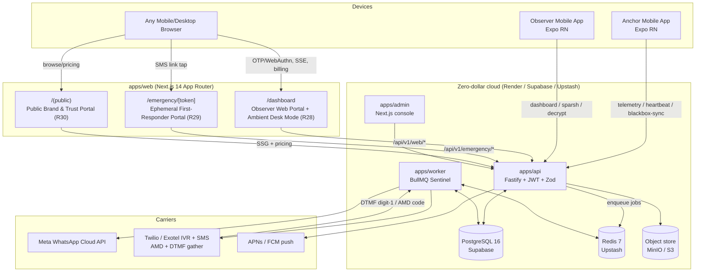
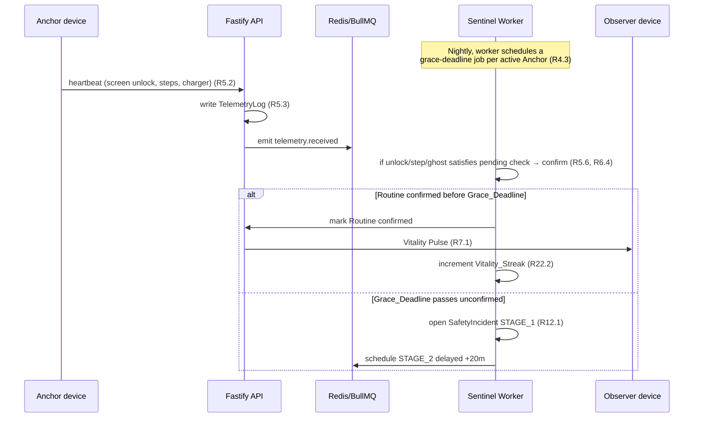
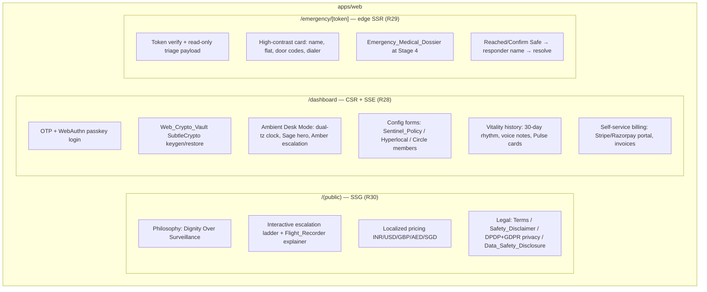
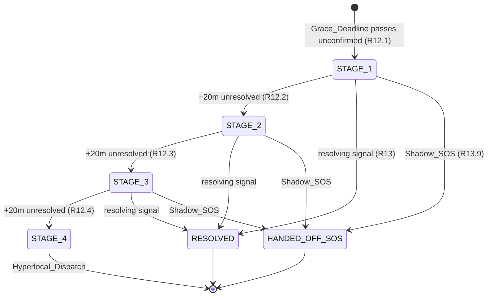
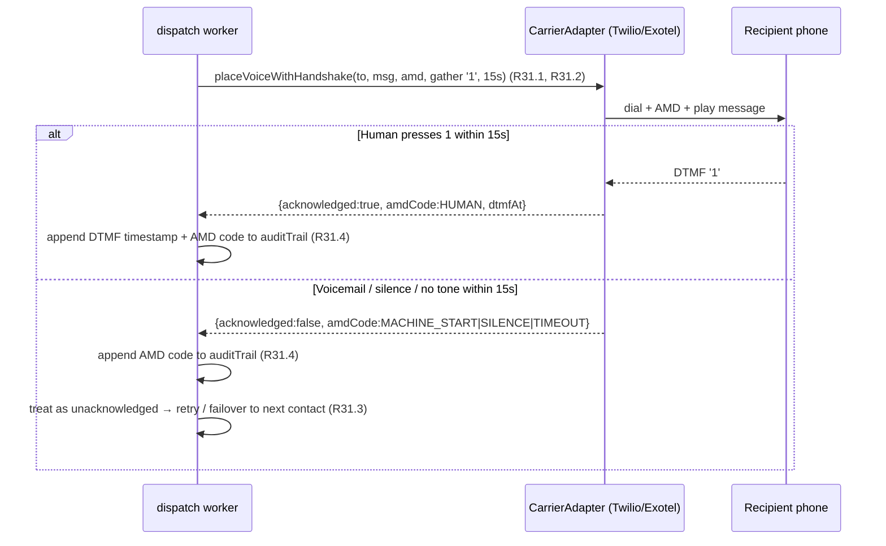
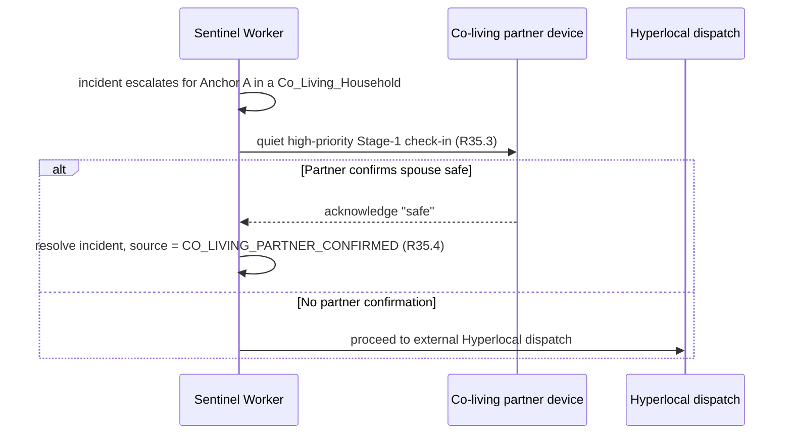

# Design Document: Kshema Ambient Safety Platform

## Overview

Kshema is an ambient personal-safety, vitality, and routine-assurance platform built on the tenet **Dignity Over Surveillance**. This document translates the 35 approved requirements into a concrete technical design across a Turborepo + pnpm monorepo comprising a Fastify API, a BullMQ Sentinel worker, a React Native (Expo) mobile app, a Next.js admin console, a Next.js **web** application (Observer portal, ephemeral responder portal, and public brand portal), and shared packages for database, types, encryption, config, and UI.

The design is organized so that every requirement maps to one or more subsystems:

| Requirement | Primary subsystem(s) |
|---|---|
| R1 Identity & cryptographic onboarding | `apps/api` auth routes, `packages/encryption`, mobile Secure Enclave |
| R2 Dual-role Circle model | `apps/api` circles routes, `packages/database` `Circle`/`CircleMember` |
| R3 Persona modes & Sentinel policy | `SentinelPolicy`, mobile persona UI, worker evaluators |
| R4 Adaptive Bayesian rhythm engine | `AdaptiveRhythmProfile`, worker rhythm engine |
| R5 Passive telemetry ingestion | telemetry routes, `TelemetryLog`, mobile background agent |
| R6 Ghost signals | mobile discovery agent, `GhostSignalLog`, worker |
| R7 Vitality Pulse loop | worker + api, `VitalityPulseLog`, mobile |
| R8/R9 Zero-knowledge Flight Recorder | `packages/encryption`, `EncryptedBlackBox`, blackbox-sync route |
| R10 Acoustic distress | mobile on-device classifier, worker incident raise |
| R11 Shadow SOS / Blackout | mobile hardware hooks, api trigger-sos, worker |
| R12 Four-stage escalation | worker escalation state machine (BullMQ delayed jobs) |
| R13 Auto-resolution | worker resolution handlers, telemetry side-effects |
| R14 Hyperlocal dispatch | worker telephony adapters, `HyperlocalContactProfile` |
| R15 Observer dashboard | mobile Observer UI, dashboard route |
| R16 Brand lexicon & visuals | `packages/ui` tokens, banned-term lint |
| R17 Multi-language | mobile i18n, worker message templating |
| R18 Background reliability | mobile Android foreground service, `DeviceConfig` |
| R19 Privacy guarantees | cross-cutting; enforced by crypto + schema constraints |
| R20 Subscription lifecycle | `Subscription`, webhooks, worker tier gating |
| R21 Admin console | `apps/admin`, admin routes, `AdminUser`/`AdminAuditLog` |
| R22 Family vitality engine | `VitalityStreak`, `SparshInteraction`, `PanchangaAlmanac` |
| R23 Key recovery | mobile recovery flow, platform key store |
| R24 Offline buffering | mobile offline queue, bulk-sync route, worker reconciliation |
| R25 Simulation mode | worker time-compression, mock carrier adapters |
| R26 Safety disclaimer gate | mobile onboarding, api acceptance record |
| R27 Data-safety disclosures | app-store manifest, consistency checks |
| R28 Observer web portal & Ambient Desk Mode | `apps/web` `/dashboard`, `Web_Crypto_Vault`, `WebAuthnCredential`, web dashboard SSE + billing routes |
| R29 Ephemeral first-responder portal | `apps/web` `/emergency/[token]`, `EmergencyAccessToken`, emergency routes (edge SSR) |
| R30 Public brand & trust portal | `apps/web` `/(public)` SSG marketing/legal, geo pricing, i18n |
| R31 AMD & DTMF handshake | `CarrierAdapter` AMD + DTMF gather, `dispatch` worker, incident audit |
| R32 Bedtime Battery Guardian | mobile evening evaluator, worker morning-flag, `BatteryWarningLog` |
| R33 Encrypted Emergency Medical Dossier | `EmergencyMedicalDossier`, envelope crypto, responder-portal release |
| R34 Sanctuary Mode | `SanctuarySchedule`, worker suspension gate, auto-resume |
| R35 Co-living households | `HouseholdProfile`, worker ghost attribution + partner check-in |

The design deliberately keeps the server **cryptographically blind** to the most sensitive data (Flight Recorder payloads), and enforces that ambient inference never requires a manual liveness action (R5.4, R19).

## Architecture

### System context



The `apps/web` application hosts three route groups on a single Next.js 14 deployment: the public marketing/legal surface `/(public)` (statically generated, R30), the authenticated Observer portal `/dashboard` (client-side Web Crypto + real-time SSE, R28), and the zero-login ephemeral responder surface `/emergency/[token]` (edge-rendered SSR, R29). All three talk only to `apps/api` over versioned routes; none hold private keys or plaintext black-box data server-side.

### Monorepo layout

```
kshema/
├─ apps/
│  ├─ api/                 # Fastify v4 + TS: auth, circles, telemetry, incidents, subscriptions, admin, webhooks
│  ├─ worker/              # BullMQ: rhythm eval, escalation FSM, telephony dispatch
│  ├─ mobile/             # Expo SDK 51+, RN 0.74+, NativeWind, Zustand, Expo Router
│  ├─ admin/              # Next.js 14 App Router, Tailwind, @tanstack/react-table
│  └─ web/                # Next.js 14 App Router, Tailwind, @tanstack/react-table, W3C Web Crypto + WebAuthn
│     └─ app/
│        ├─ (public)/     # R30 Public Brand & Trust Portal (SSG marketing + legal)
│        ├─ dashboard/    # R28 Observer Web Portal + Ambient Desk Mode
│        └─ emergency/[token]/  # R29 Ephemeral First-Responder Portal (edge SSR)
├─ packages/
│  ├─ database/           # Prisma schema + client + migrations
│  ├─ types/              # shared interfaces, DTOs, Zod schemas
│  ├─ encryption/         # AES-256-GCM + RSA-OAEP utilities
│  ├─ config/             # ESLint/Prettier/TS presets + banned-term lint rule
│  └─ ui/                 # NativeWind/Tailwind tokens + primitives
├─ docker-compose.yml     # Postgres 16, Redis 7, LocalStack/MinIO
└─ turbo.json
```

The `packages/types` and `packages/encryption` packages are consumed by both `apps/api` and `apps/mobile`, guaranteeing that the encrypt (mobile) and decrypt (mobile) sides and the DTO validation (api) share one source of truth. The server never imports any decrypt capability for Flight Recorder payloads (R8.6, R19.3).

### Request/data flow: morning routine → confirmation or escalation



## Components and Interfaces

All routes are versioned under `/api/v1`. JWT bearer auth is required except OTP request/verify and carrier webhooks (which use signature verification). All request/response bodies validate against Zod schemas exported from `packages/types`.

### apps/api — Fastify routes

**Auth & identity (R1)**

- `POST /api/v1/auth/otp/request` — body `{ phone }`. Generates OTP, stores hashed OTP + expiry, dispatches via SMS. Returns `{ challengeId }`. (R1.1)
- `POST /api/v1/auth/otp/verify` — body `{ challengeId, code, clientPublicKeyPem, preferredName?, timezone, pushToken? }`. On success, upserts `User`, persists `publicKeyPem`, `timezone`, `preferredName`, tokens (R1.2, R1.5, R1.6), issues JWT access/refresh. On wrong/expired code returns `401` with descriptive error (R1.3). The private key never transits — only `clientPublicKeyPem` is accepted (R1.8).

**Circles (R2)**

- `POST /api/v1/circles` — `{ name }` → creates `Circle`, adds requester as `CircleMember`, initializes `Subscription` in `TRIAL` for 14 days (R2.1, R20.1). Returns circle + first invitation (R2.2).
- `POST /api/v1/circles/:id/invitations` — mints a redeemable, expiring invite token.
- `POST /api/v1/circles/join` — `{ inviteToken, role, publicKeyPem }` → validates token; on valid adds `CircleMember` with role `ANCHOR|OBSERVER|MUTUAL` and records Observer public key for key wrapping (R2.3, R2.5, R2.8); invalid/expired → `400` descriptive error (R2.4).
- `PATCH /api/v1/circles/:id/members/:memberId` — set `canTriggerIVR`, `canAccessBlackBox` (R2.7). SUPER member only.

**Telemetry (R5, R6, R24)**

- `POST /api/v1/telemetry/heartbeat` — `{ screenUnlocks[], stepDelta, battery, chargerState, capturedAt }` → append `TelemetryLog`, emit `telemetry.received` (R5.2, R5.3).
- `POST /api/v1/telemetry/ghost-signal` — `{ signalType, source, detectedAt }` → append `GhostSignalLog`, emit `ghost.received` (R6.2, R6.3).
- `POST /api/v1/telemetry/bulk-sync` — `{ heartbeats[], ghostSignals[], lastSyncAt }` → idempotent bulk insert keyed on client `capturedAt`+device; updates `lastTelemetrySyncAt`; worker reconciles (R24.2, R24.3). Each buffered heartbeat is subjected to a **clock-skew validation** against server `receivedAt`: a heartbeat is accepted into the rhythm baseline only if `capturedAt <= receivedAt + 2 minutes` AND `capturedAt >= receivedAt - 7 days`. Telemetry whose `capturedAt` falls outside this window (a mis-set device clock) is still persisted but flagged with a clock-skew warning and **excluded from the 14-day Bayesian rhythm baseline**, so a bad device clock cannot corrupt the `Adaptive_Rhythm_Profile` (R24, R4).
- `POST /api/v1/telemetry/blackbox-sync` — `{ encryptedPayload, iv, authTag, recipientKeys: [{ observerId, wrappedKey }], capturedRange }` → stores the `EncryptedBlackBox` verbatim plus one `BlackBoxRecipientKey` row per fan-out-wrapped Observer key. Server performs **no decryption** (R8.4–8.6).

**Observer dashboard (R15)**

- `GET /api/v1/observer/dashboard` — returns each Anchor's derived well-being state (`ALL_WELL` | `escalationStage` | `SHIELD_PAUSED`), preferredName, last confirmation time. Excludes any continuous location trace (R15.5, R19.1). Response strings drawn from Brand_Lexicon (R15.4).

**Incidents (R11, R13, R14)**

- `POST /api/v1/incidents/:id/resolve` — `{ source }` → manual dismissal (Anchor) or override (authorized Observer). Emits resolution; worker halts pending stages (R13.6, R13.7, R13.8).
- `POST /api/v1/incidents/trigger-sos` — `{ decryptedLocation }` (Anchor only) → creates Shadow_SOS incident, releases black box to permitted Observers, hands off any active incident (R11.4–11.6, R13.9).
- `POST /api/v1/incidents/:id/blackbox` — Observer fetch of released `EncryptedBlackBox`; denies if member lacks `canAccessBlackBox` or not released (R9.3, R8.8); records access in incident audit trail (R19.6).

**Vitality & family (R7, R22)**

- `POST /api/v1/vitality/voice-note` — `{ anchorId, audio ≤10s }` → stores short reply object, delivers to Anchor (R7.4).
- `POST /api/v1/sparsh` — `{ circleId, toUserId, type }` → records `SparshInteraction`, pushes animated card (R22.9, R22.11).
- `GET /api/v1/sparsh/rhythm?days=30` — 30-day connection rhythm (R22.11).
- `GET /api/v1/panchanga` — computed almanac card for Anchor location + language (R22.12–14).

**Subscriptions (R20)**

- `POST /api/v1/subscriptions/checkout` — begins purchase for monthly/annual Pro.
- `POST /api/v1/subscriptions/webhooks/apple` · `/google` · `/upi` — signature-verified receipt/token validation; on success sets `PRO` and resumes worker routines (R20.8, R20.10); failures land in admin error queue (R21.20).

**Admin (`/api/v1/admin/*`) (R21)** — guarded by `AdminAuthGuard` (MFA + role). Every handler writes an `AdminAuditLog` row (R21.9).

- `GET /admin/fleet/pulse`, `GET /admin/carrier/health`, `GET /admin/incidents/live`, `POST /admin/incidents/:id/retry-dispatch`, `GET /admin/subscriptions`, `PATCH /admin/circles/:id/trial`, `POST /admin/users/:id/purge-request`, `POST /admin/devices/:id/wakefulness-test`. Role scoping per R21.2–21.4; out-of-role → `403` + security-violation audit (R21.5). Phone numbers masked to last 4 digits except active Stage-4 triage (R21.8).

**WhatsApp webhooks (R12, R13, R17)**

- `POST /api/v1/webhooks/whatsapp` — inbound Anchor replies resolve the incident (R13.5); delivery-status callbacks feed carrier health (R21.11, R21.13).

**Web portal & WebAuthn (R28)** — JWT session issued after OTP/WebAuthn; used by `apps/web/dashboard`.

- `POST /api/v1/web/auth/otp/request` · `POST /api/v1/web/auth/otp/verify` — same OTP challenge as mobile, but the verified session is scoped to the browser and marks the login channel `WEB` (R28.1). Verify accepts `clientPublicKeyPem` generated by the `Web_Crypto_Vault` (never a private key) (R28.2).
- `POST /api/v1/web/webauthn/register/options` · `POST /api/v1/web/webauthn/register/verify` — issues a FIDO2 attestation challenge and stores the resulting `WebAuthnCredential` (credentialId, COSE publicKey, counter) after the browser completes `navigator.credentials.create()` (R28.1).
- `POST /api/v1/web/webauthn/authenticate/options` · `POST /api/v1/web/webauthn/authenticate/verify` — assertion challenge + verification for passkey login (TouchID / Windows Hello / platform authenticators). On success increments the stored signature `counter` and rejects any non-increasing counter (clone detection).
- `GET /api/v1/web/dashboard/stream` — **Server-Sent Events** (text/event-stream) channel pushing per-Anchor well-being state, active `IncidentStage`, and dual-timezone tick for Ambient Desk Mode; silent background updates with no page reload (R28.5, R28.8, R28.9). The Observer web dashboard connects this stream **directly to the persistent Fastify service** (`apps/api`) over CORS, never through a Next.js serverless API route, because serverless function execution timeouts would sever long-lived SSE connections while the always-on Fastify deployment (Render/Railway) keeps them open indefinitely. A WebSocket upgrade at `/api/v1/web/dashboard/ws` (also on the Fastify backend) is the interactive fallback for environments that prefer bidirectional transport.
- `GET /api/v1/web/vitality/rhythm?days=30` — 30-day connection-rhythm calendar (morning confirmation times, Sparsh interactions, step progression); excludes any location breadcrumb (R28.13, R28.15).
- `GET /api/v1/web/vitality/voice-notes` — archived ≤10s micro-voice replies + `VitalityPulseLog` cards for playback (R28.14).
- Config surfaces reuse existing routes: `PATCH .../sentinel-policy` (wake/bed times, grace intervals, languages, WhatsApp schedules — R28.10), Hyperlocal profile upsert (R28.11), and circle member invite/role/permission routes (R28.12).

**Billing self-service (R28.16, R28.17, R20)**

- `POST /api/v1/web/billing/portal-session` — creates a Stripe Customer Portal (international cards) or Razorpay subscription-management session and returns the redirect URL (R28.16).
- `GET /api/v1/web/billing/summary` — active `Subscription_Tier`, trial expiration countdown, current `BillingInterval` (R28.17).
- `POST /api/v1/web/billing/interval` — `{ interval: MONTHLY|ANNUAL }` switch between monthly and annual Pro (R28.17).
- `GET /api/v1/web/billing/invoices` · `GET /api/v1/web/billing/invoices/:id.pdf` — list and download tax-compliant PDF invoices (R28.17).

**Emergency responder portal (R29, R33)** — unauthenticated; access controlled solely by the signed `Emergency_Access_Token` in the path.

- `GET /api/v1/emergency/:token` — verifies token signature, expiry (≤60m), incident binding, and non-invalidation; returns the read-only triage payload: Anchor preferred display name, society/building/flat, door-access + smart-lock backup codes, one-tap dialer number for the Primary Observer, and — when the bound incident is at STAGE_4 — the decrypted-for-emergency `Emergency_Medical_Dossier` (R29.6, R33.3). Excludes location history, financial, and chat data (R29.7). Records the visit with source IP + user-agent in the incident audit trail (R29.12). Backed by edge SSR for <1.5s render on 3G (R29.5).
- `POST /api/v1/emergency/:token/confirm` — `{ responderName }` → resolves the bound incident with `RESPONDER_CONFIRMED` resolution source, notifies all Circle Observers, invalidates the token, and revokes dossier access (R29.9, R29.10, R33.4). Logs the click event (R29.12).
- Expired/invalid tokens return a `410 Gone`-style informational body the portal renders as "the safety check has concluded" (R29.11).

**Sanctuary Mode (R34)**

- `POST /api/v1/sanctuary` — `{ anchorId, startsAt, resumesAt (≤14d), reason? }` (authorized User) → creates/activates a `SanctuarySchedule` (R34.1).
- `DELETE /api/v1/sanctuary/:id` — early manual end (optional; automatic resume needs no call — R34.4).
- `GET /api/v1/sanctuary/active?anchorId=` — current active window for banner rendering (R34.3). Also settable from `apps/web/dashboard`.

**Emergency Medical Dossier (R33)**

- `PUT /api/v1/medical-dossier` — `{ encryptedPayload, iv, authTag, encryptedEmergencyKey, ...maskedMeta }` upsert of the client/envelope-encrypted `EmergencyMedicalDossier`; server stores ciphertext only (R33.1, R33.2). No `GET` exists for Admin or ordinary Observer surfaces — the plaintext is reachable only through the Stage-4 responder-portal release path (R33.2, R33.3).

### apps/worker — BullMQ queues & job flow

Queues (Redis 7 / Upstash):

- `rhythm-eval` — nightly per-Anchor job computing Grace_Deadline and scheduling a delayed `grace-check` (R4.3).
- `escalation` — the four-stage state machine; each stage transition schedules the next as a **delayed job** (+20m, or compressed under Simulation_Mode) (R12.2–12.4, R25.1).
- `dispatch` — telephony/messaging fan-out (WhatsApp, SMS, IVR) with retry + fallback (R14, R21.12), including carrier Answering Machine Detection and the Interactive_Voice_Handshake (R31).
- `resolution` — consumes telemetry/ghost/response events; resolves incidents and cancels pending escalation jobs (R13).
- `vitality` — emits Vitality Pulses, increments streaks (R7, R22).

Job flow is detailed in the **Escalation State Machine** section below.

### apps/mobile — background telemetry agent

- **Zustand** stores hold session, circle membership, persona policy, dashboard state.
- **Expo Router** drives a unified dynamic UI that renders Anchor vs Observer surfaces based on `CircleMember.role` (Mutual renders both).
- Background agent: Android minimum-priority **foreground service** + broadcast receivers for screen/power events (R18.1, R18.3); iOS background tasks. Captures passive signals, ghost signals, and 3-minute Flight Recorder snapshots; encrypts every 15 minutes (R8.1–8.5); buffers to `Offline_Telemetry_Queue` when offline and bulk-syncs on reconnect (R24.1, R24.2).
- On-device acoustic classifier runs in memory only (R10.2), never persisting/transmitting audio (R19.4).

### apps/admin — console

Next.js 14 App Router with `AdminAuthGuard` wrapping all routes; MFA session (R21.1). `@tanstack/react-table` powers fleet, carrier, incident, and subscription grids. Live incident view subscribes to a server-sent stream of active incidents (R21.10) and raises visual alarms on dispatch failure (R21.11). No UI affordance exists to decrypt black boxes or poll live location/audio (R21.6, R21.7).

### apps/web — Next.js web application (R28, R29, R30)

A single Next.js 14 App Router deployment hosts three route groups, chosen per surface for the right rendering strategy and trust boundary.



**Observer Web Portal `/dashboard` (R28)**

- **Auth**: OTP login (`/api/v1/web/auth/otp/*`) with optional WebAuthn passkey (FIDO2 / TouchID / Windows Hello) registered and asserted via `navigator.credentials` (R28.1). A 30-minute idle timer (reset on user interaction) locks the interface and requires biometric/passcode re-authentication before further use (R28.4).
- **`Web_Crypto_Vault`**: uses the W3C Web Cryptography API (`crypto.subtle`) to generate or restore the Observer RSA-OAEP key pair entirely in the browser. The private key is created as a non-extractable `CryptoKey` (or wrapped and stored in IndexedDB behind the passphrase/passkey) and is **never transmitted** to the API — only the exported public key PEM is sent (R28.2). During an authorized Stage-4 release, the vault fetches the released `EncryptedBlackBox`, RSA-OAEP-unwraps the symmetric key and AES-GCM-decrypts the payload **inside the browser session**; no decrypted bytes are sent back to the server (R28.3).
- **Ambient Desk Mode**: a low-distraction full-viewport layout for a pinned tab or secondary monitor. The browser subscribes to the SSE stream **directly on the persistent Fastify backend** (`apps/api`, e.g. `https://api.<domain>/api/v1/web/dashboard/stream`) over CORS — **not** through a Next.js serverless API route — for silent background refresh (R28.5, R28.9). This routing is deliberate: serverless proxies (e.g. Vercel functions) impose per-invocation execution timeouts that would terminate a long-lived SSE connection, whereas the always-on Fastify service (deployed on Render/Railway) holds the `text/event-stream` connection open indefinitely. A WebSocket upgrade (`/api/v1/web/dashboard/ws`) on the same backend remains the interactive/bidirectional fallback. Renders a synchronized dual-timezone clock (Observer vs Anchor local time, R28.6), a Muted Sage Green `#3D6B52` "All Well" hero card with the verified wakefulness timestamp while healthy (R28.7), and shifts the canvas to Soft Amber `#D9822B` with the active `Escalation_Stage` and direct-action controls (place voice call, mark Anchor confirmed safe) during an escalating incident (R28.8).
- **Config surfaces**: keyboard-friendly forms for `Sentinel_Policy` (wake/bed times, grace intervals, languages, WhatsApp schedules — R28.10), `Hyperlocal_Contact_Profile` (society/block/flat/gate intercom/smart-lock codes — R28.11), and Circle member invite/role/permission management (R28.12).
- **Vitality history**: interactive 30-day connection-rhythm calendar, archived micro-voice-note playback, and `Vitality_Pulse` cards — with **no** location breadcrumbs anywhere in the view (R28.13–R28.15).
- **Billing**: self-service via the Stripe Customer Portal (international cards) or Razorpay (regional recurring), showing tier + trial countdown, tax-compliant PDF invoices, and a monthly/annual switch (R28.16, R28.17).
- All text is drawn from the Brand_Lexicon and excludes every Banned_Term (R28.18) — the same `no-banned-terms` lint (see Cross-Cutting Concerns) runs over `apps/web`.

**Ephemeral First-Responder Portal `/emergency/[token]` (R29)**

- **Zero-login, edge-rendered**: the dynamic segment `[token]` is server-rendered at the edge with a minimal, high-contrast, single-purpose page and inlined critical CSS to complete initial render within 1.5s on a constrained 3G connection (R29.4, R29.5). No authentication, account, or app install is required — the signed token in the URL is the sole credential.
- **Payload**: Anchor preferred display name, society/building/flat, door-access instructions + smart-lock backup codes, and a single-tap `tel:` dialer to the Primary Observer (R29.6); the `Emergency_Medical_Dossier` is displayed when the bound incident is at Stage 4 (R33.3). Location history, financial, and chat data are structurally excluded from the payload DTO (R29.7).
- **Triage**: a prominent single-tap "Reached / Confirm Safe" control prompts for the responder name, then calls `POST /api/v1/emergency/:token/confirm`, which resolves the incident with the new `RESPONDER_CONFIRMED` resolution source, notifies Observers, and invalidates the token (R29.8, R29.9, R29.10). Expired/invalid tokens render an informational "the safety check has concluded" screen (R29.11). Every visit, page load, and button click is audited with source IP + user-agent to the incident audit trail (R29.12).

**Public Brand & Trust Portal `/(public)` (R30)**

- **Static generation (SSG/ISR)** for marketing and legal pages: the "Dignity Over Surveillance" philosophy, an interactive escalation-ladder + `Flight_Recorder` explainer (R30.1, R30.2), and the legal set — Terms of Service, `Safety_Disclaimer`, DPDP/GDPR-compliant Privacy Policy, and the public `Data_Safety_Disclosure` (R30.6, R30.7).
- **Localized pricing** in INR, USD, GBP, AED, and SGD with geo-based currency detection (edge geo header → currency, with a manual override), showing the 14-day Trial, monthly/annual Pro, and Shield_Paused states (R30.3, R30.4).
- **Localization**: all public content is available in the five Supported_Languages (en, hi, kn, ta, te) (R30.5).
- **Brand adherence**: palette locked to Sandalwood Cream `#FDFBF7`, Terracotta `#C85A32`, Deep Charcoal `#1F2421`; the `no-banned-terms` lint runs across all public pages at build time (R30.8).

## Data Models

Complete Prisma schema (`packages/database/schema.prisma`). PostgreSQL 16.

```prisma
// ---------- Enums ----------
enum CircleRole        { ANCHOR OBSERVER MUTUAL }
enum SentinelMode      { ELDERLY_CARE SOLO_LIVING ACTIVE_SESSION JOURNEY_WATCH POST_OP_RECOVERY }
enum IncidentStage     { STAGE_1_CONVERSATIONAL_WHATSAPP STAGE_2_GENTLE_DEVICE_CHIME STAGE_3_OBSERVER_SILENT_ALERT STAGE_4_HYPERLOCAL_DISPATCH }
enum IncidentStatus    { OPEN RESOLVED HANDED_OFF_SOS }
enum ResolutionSource  { SCREEN_UNLOCK STEP_DELTA CHARGER_UNPLUG GHOST_SIGNAL WHATSAPP_RESPONSE ANCHOR_DISMISSAL OBSERVER_OVERRIDE SHADOW_SOS_HANDOFF CO_LIVING_PARTNER_CONFIRMED RESPONDER_CONFIRMED }
enum SubscriptionTier  { TRIAL PRO SHIELD_PAUSED }
enum BillingInterval   { MONTHLY ANNUAL }
enum AdminRole         { SUPER_ADMIN SUPPORT_AGENT BILLING_OPS }
enum AuditAction       { VIEW QUERY MUTATION EXPORT SECURITY_VIOLATION }
enum SparshType        { MORNING_CHAI PRANAM_BLESSING MORNING_SUN MARIGOLD_FLOWER HEART_BLESSING }
enum GhostSignalType   { MEDIA_DEVICE_WAKE HOME_WIFI_REASSOCIATION }
enum DossierAccessState { LOCKED RELEASED_EMERGENCY EXPIRED }
enum LoginChannel      { MOBILE WEB }
enum BatteryWarningKind { BEDTIME_LOW PRE_DAWN_BATTERY_EXHAUSTION_WARNING }

// ---------- Core identity & circle ----------
model User {
  id            String   @id @default(cuid())
  phone         String   @unique
  publicKeyPem  String
  preferredName String?
  timezone      String   @default("Asia/Kolkata")
  pushTokens    String[]
  disclaimerAcceptedAt      DateTime?
  disclaimerVersion         String?
  createdAt     DateTime @default(now())
  memberships   CircleMember[]
  telemetry     TelemetryLog[]
  ghostSignals  GhostSignalLog[]
  passkeys      WebAuthnCredential[]     // R28
  medicalDossier EmergencyMedicalDossier? // R33
  sanctuary     SanctuarySchedule[]      // R34
  batteryWarnings BatteryWarningLog[]    // R32
}

model Circle {
  id           String        @id @default(cuid())
  name         String
  createdAt    DateTime      @default(now())
  members      CircleMember[]
  policy       SentinelPolicy?
  subscription Subscription?
  streak       VitalityStreak?
  incidents    SafetyIncident[]
}

model CircleMember {
  id               String     @id @default(cuid())
  circleId         String
  userId           String
  role             CircleRole
  canTriggerIVR    Boolean    @default(false)
  canAccessBlackBox Boolean   @default(false)
  observerPublicKeyPem String?           // recorded for black-box key wrapping (R2.8)
  circle           Circle     @relation(fields: [circleId], references: [id])
  user             User       @relation(fields: [userId], references: [id])
  @@unique([circleId, userId])
}

// ---------- Sentinel policy & rhythm ----------
model SentinelPolicy {
  id         String        @id @default(cuid())
  circleId   String        @unique
  anchorId   String
  modes      SentinelMode[]  @default([ELDERLY_CARE])   // default persona (R3.2)
  wakeConfig Json          // per-mode params: transit deadline, recovery threshold, active hours
  circle     Circle        @relation(fields: [circleId], references: [id])
  rhythm     AdaptiveRhythmProfile?
}

model AdaptiveRhythmProfile {
  id             String   @id @default(cuid())
  policyId       String   @unique
  wakeSamples    Int[]                 // rolling 14-day minute-of-day samples (R4.1)
  meanWakeMinute Float
  stdDevWakeMinute Float
  avgStep30d     Float
  weekendOffsetMin Int    @default(45) // R4.4
  fatigueOffsetMin Int    @default(30) // R4.5
  updatedAt      DateTime @updatedAt
  policy         SentinelPolicy @relation(fields: [policyId], references: [id])
}

// ---------- Telemetry & signals ----------
model TelemetryLog {
  id           String   @id @default(cuid())
  userId       String
  screenUnlock Boolean  @default(false)
  stepDelta    Int      @default(0)
  batteryLevel Int?
  chargerState String?               // PLUGGED / UNPLUGGED
  capturedAt   DateTime
  receivedAt   DateTime @default(now())
  user         User     @relation(fields: [userId], references: [id])
  @@index([userId, capturedAt])
}

model GhostSignalLog {
  id         String          @id @default(cuid())
  userId     String
  signalType GhostSignalType
  source     String?
  detectedAt DateTime
  user       User            @relation(fields: [userId], references: [id])
  @@index([userId, detectedAt])
}

// ---------- Zero-knowledge black box ----------
model EncryptedBlackBox {
  id              String   @id @default(cuid())
  circleId        String
  anchorId        String
  encryptedPayload Bytes                 // AES-256-GCM ciphertext
  iv              Bytes                  // 96-bit nonce
  authTag         Bytes                  // GCM tag
  recipientKeys   BlackBoxRecipientKey[] // fan-out-wrapped 256-bit AES key, one row per authorized Observer
  capturedRangeStart DateTime
  capturedRangeEnd   DateTime
  released        Boolean  @default(false)  // gate per R8.7/8.8
  createdAt       DateTime @default(now())
  @@index([anchorId, createdAt])
}

// One RSA-OAEP-wrapped copy of the payload symmetric key per authorized Observer,
// so each Observer can independently unwrap (fan-out wrap; see Zero-Knowledge Cryptography Design).
model BlackBoxRecipientKey {
  id         String            @id @default(cuid())
  boxId      String
  observerId String
  wrappedKey Bytes             // RSA-OAEP-wrapped 256-bit AES key for this observer
  box        EncryptedBlackBox @relation(fields: [boxId], references: [id], onDelete: Cascade)
  @@unique([boxId, observerId])
}

// ---------- Incidents ----------
model SafetyIncident {
  id           String          @id @default(cuid())
  circleId     String
  anchorId     String
  stage        IncidentStage
  status       IncidentStatus  @default(OPEN)
  simulated    Boolean         @default(false)   // R25.4
  batteryDepletionLikely Boolean @default(false) // R32.4 "Likely Battery Depletion" flag on STAGE_1
  auditTrail   Json            // ordered array of {stage, at, cause}; also holds DTMF/AMD + responder-portal visit events (R31.4, R29.12)
  resolutionSource ResolutionSource?
  openedAt     DateTime        @default(now())
  resolvedAt   DateTime?
  circle       Circle          @relation(fields: [circleId], references: [id])
  @@index([circleId, status])
}

model HyperlocalContactProfile {
  id            String @id @default(cuid())
  anchorId      String @unique
  building      String?
  flat          String?
  society       String?
  doorAccess    String?
  primaryObserverPhone String?
  gatePhone     String?
  neighborPhone String?
}

// ---------- Vitality & family engine ----------
model VitalityPulseLog {
  id           String   @id @default(cuid())
  circleId     String
  anchorId     String
  confirmedAt  DateTime
  context      Json     // steps, weather
  createdAt    DateTime @default(now())
}

model VitalityStreak {
  id            String   @id @default(cuid())
  circleId      String   @unique
  count         Int      @default(0)
  lastConfirmedDay String?          // yyyy-mm-dd in anchor tz
  freezeUntil   DateTime?           // Streak_Freeze (R22.5)
  circle        Circle   @relation(fields: [circleId], references: [id])
}

model SparshInteraction {
  id        String     @id @default(cuid())
  circleId  String
  fromUserId String
  toUserId  String
  type      SparshType
  createdAt DateTime   @default(now())
  @@index([circleId, createdAt])
}

model PanchangaAlmanac {
  id         String   @id @default(cuid())
  date       String   // yyyy-mm-dd
  locationKey String  // coarse geo bucket
  sunrise    String
  sunset     String
  tithi      String
  nakshatra  String
  masa       String
  festivals  String[]
  proverbKey String
  @@unique([date, locationKey])
}

// ---------- Device & subscription ----------
model DeviceConfig {
  id            String  @id @default(cuid())
  userId        String
  platform      String  // ANDROID / IOS
  oem           String? // Xiaomi, Samsung, OnePlus, Vivo, Apple
  batteryExempt Boolean @default(false)
  foregroundServiceActive Boolean @default(false)
  lastTelemetrySyncAt DateTime?
  @@index([userId])
}

model Subscription {
  id            String           @id @default(cuid())
  circleId      String           @unique
  tier          SubscriptionTier @default(TRIAL)
  interval      BillingInterval?
  trialEndsAt   DateTime
  proSince      DateTime?
  externalRef   String?          // StoreKit / Play / UPI token
  circle        Circle           @relation(fields: [circleId], references: [id])
}

// ---------- Admin ----------
model AdminUser {
  id        String    @id @default(cuid())
  email     String    @unique
  role      AdminRole
  mfaEnrolled Boolean @default(false)
  createdAt DateTime  @default(now())
  auditLogs AdminAuditLog[]
}

model AdminAuditLog {
  id           String      @id @default(cuid())
  adminUserId  String
  action       AuditAction
  sourceIp     String
  targetEntity String
  justification String?
  simulated    Boolean     @default(false)
  createdAt    DateTime    @default(now())
  admin        AdminUser   @relation(fields: [adminUserId], references: [id])
  @@index([adminUserId, createdAt])
}

model CarrierGatewayMetric {
  id          String   @id @default(cuid())
  gateway     String   // WHATSAPP / TWILIO / EXOTEL
  deliveryLatencyMs Int?
  templateRejections Int @default(0)
  dltStatus   String?
  ivrSuccess  Boolean?
  errorRate   Float?
  windowStart DateTime
  createdAt   DateTime @default(now())
  @@index([gateway, windowStart])
}

// ---------- Web portal: WebAuthn passkeys (R28) ----------
model WebAuthnCredential {
  id           String   @id @default(cuid())
  userId       String
  credentialId String   @unique          // base64url credential id from the authenticator
  publicKey    Bytes                      // COSE-encoded public key
  counter      Int      @default(0)       // signature counter; must be non-decreasing (clone detection)
  transports   String[]                   // e.g. internal, hybrid, usb
  createdAt    DateTime @default(now())
  user         User     @relation(fields: [userId], references: [id])
  @@index([userId])
}

// ---------- Ephemeral first-responder access (R29) ----------
model EmergencyAccessToken {
  id            String    @id @default(cuid())
  incidentId    String    @unique          // single-incident binding (R29.1)
  tokenHash     String    @unique          // hash of the signed token; raw token is never stored
  scope         String    @default("EMERGENCY_TRIAGE_READ")  // read-only triage scope (R29.2)
  expiresAt     DateTime                    // <= issuedAt + 60m (R29.2)
  invalidatedAt DateTime?                   // set on incident resolution (R29.10)
  createdAt     DateTime  @default(now())
  @@index([incidentId, expiresAt])
}

// ---------- Encrypted Emergency Medical Dossier / ICE (R33) ----------
model EmergencyMedicalDossier {
  id                    String            @id @default(cuid())
  userId                String            @unique
  // Encrypted-at-rest payload; server holds only ciphertext (R33.2).
  encryptedPayload      Bytes                              // AES-256-GCM ciphertext of the ICE JSON
  iv                    Bytes
  authTag               Bytes
  encryptedEmergencyKey Bytes                              // symKey wrapped to the circle emergency key (see crypto)
  // Optional masked/non-sensitive metadata for integrity checks only (no plaintext clinical data):
  bloodGroup            String?                            // OPTIONAL: only if the deployment opts into plaintext ICE; default null
  allergies             String[]          @default([])     // (see design note: prefer encryptedPayload-only)
  chronicConditions     String[]          @default([])
  criticalMedications   String[]          @default([])
  attendingDoctorName   String?
  attendingDoctorPhone  String?
  healthInsurancePolicy String?
  accessState           DossierAccessState @default(LOCKED)  // R33.2/R33.3/R33.4 lifecycle
  updatedAt             DateTime          @updatedAt
  user                  User              @relation(fields: [userId], references: [id])
}

// ---------- Sanctuary / travel / medical-procedure mode (R34) ----------
model SanctuarySchedule {
  id        String   @id @default(cuid())
  userId    String                        // the Anchor whose evaluation is suspended
  startsAt  DateTime
  resumesAt DateTime                       // <= startsAt + 14 days (R34.1)
  reason    String?
  isActive  Boolean  @default(true)
  createdAt DateTime @default(now())
  user      User     @relation(fields: [userId], references: [id])
  @@index([userId, isActive, resumesAt])
}

// ---------- Co-living households (R35) ----------
model HouseholdProfile {
  id                   String   @id @default(cuid())
  householdName        String
  anchorIds            String[]                 // co-living Anchors sharing this domicile
  sharedWifiBssids     String[] @default([])    // BSSIDs treated as household activity
  sharedMediaDeviceIds String[] @default([])    // media devices treated as household activity
  createdAt            DateTime @default(now())
  @@index([householdName])
}

// ---------- Bedtime Battery Guardian log (R32) ----------
model BatteryWarningLog {
  id           String            @id @default(cuid())
  userId       String
  kind         BatteryWarningKind
  batteryLevel Int
  chargerState String                        // PLUGGED / UNPLUGGED
  loggedAt     DateTime          @default(now())
  user         User              @relation(fields: [userId], references: [id])
  @@index([userId, loggedAt])
}
```

Design notes: `EncryptedBlackBox` intentionally exposes no plaintext columns and the API layer has no private key — the server cannot decrypt (R8.6, R19.3). The payload symmetric key is not stored as a single wrapped blob; instead it is fan-out-wrapped once per black-box-authorized Observer and persisted as normalized `BlackBoxRecipientKey` rows (one row per `(boxId, observerId)`), so multiple authorized Observers can each independently RSA-OAEP-unwrap the same payload with their own private key. A simpler `encryptedSymKeys Json` map (keyed by `observerId → wrappedKey`) would also satisfy the fan-out requirement, but the design chooses the normalized 1-to-many relation for referential integrity, cascade cleanup, and per-Observer key rotation (R23.4). `TelemetryLog` has no continuous-location column, satisfying R5.5/R19.1 by construction. `SafetyIncident.auditTrail` is an append-only JSON array capturing every stage transition with timestamp and cause (R12.6), and also every AMD/DTMF handshake result (R31.4) and responder-portal visit/click with IP + user-agent (R29.12).

`EmergencyMedicalDossier` follows the same zero-knowledge posture as the black box: the authoritative clinical content lives only in `encryptedPayload` (AES-256-GCM, symmetric key wrapped to a circle **emergency key** — see Zero-Knowledge Cryptography Design). The individual clinical columns are optional and default to null; a privacy-maximal deployment stores nothing in them and relies on `encryptedPayload` alone, so neither Admin nor ordinary Observer surfaces can read the dossier during normal operation (R33.2). `accessState` moves `LOCKED → RELEASED_EMERGENCY` when the bound incident reaches Stage 4 and back to `EXPIRED`/`LOCKED` on resolution (R33.3, R33.4). `EmergencyAccessToken` stores only a hash of the signed token (never the raw token), is uniquely bound to one `incidentId` (R29.1), carries a ≤60-minute `expiresAt` and a read-only `scope` (R29.2), and is stamped `invalidatedAt` the moment the incident resolves (R29.10). `WebAuthnCredential` holds a COSE public key and a monotonic signature `counter` for passkey login (R28.1). `SanctuarySchedule` is indexed on `(userId, isActive, resumesAt)` so the worker can cheaply find both active suspensions and windows due for automatic resume (R34).

## Correctness Properties

*A property is a characteristic or behavior that should hold true across all valid executions of a system — essentially, a formal statement about what the system should do. Properties serve as the bridge between human-readable specifications and machine-verifiable correctness guarantees.*

Each property below is universally quantified and implementable as a single property-based test (min. 100 iterations). Suggested generators are noted for `fast-check`.

### Property 1: Black-box round-trip reproduces snapshots

*For all* valid rolling buffers (0–20 context snapshots) and any generated RSA-2048 keypair, serializing, compressing, and encrypting the buffer into an Encrypted_Black_Box and then decrypting it with the authorized private key SHALL yield context snapshots deep-equal to the original buffer.

*Generator:* `fc.array(snapshotArb, {maxLength:20})`, fresh keypair per run.

**Validates: Requirements 8.10, 9.1**

### Property 2: Tampered payload fails integrity verification

*For all* Encrypted_Black_Boxes, mutating any single byte of the ciphertext, IV, or auth tag SHALL cause decryption to reject the payload with a decryption-integrity error rather than return data.

*Generator:* encrypt random buffer, then `fc.integer` index + `fc.integer(1,255)` XOR on a randomly chosen field.

**Validates: Requirements 9.2**

### Property 3: Black-box access authorization

*For all* CircleMembers with arbitrary permission flags and Encrypted_Black_Boxes with arbitrary release state, a fetch of the payload SHALL be granted if and only if the member holds `canAccessBlackBox` AND the box has been released (via Stage-4 or Shadow_SOS); otherwise it SHALL be denied with an authorization error.

*Generator:* `fc.record({ canAccessBlackBox: fc.boolean(), released: fc.boolean() })`.

**Validates: Requirements 8.7, 8.8, 9.3**

### Property 4: Grace-deadline formula with offsets

*For all* Adaptive_Rhythm_Profiles, day-of-week values, and prior-day step counts, the computed Grace_Deadline SHALL equal `meanWakeMinute + 2*stdDevWakeMinute`, plus 45 minutes iff the day is Saturday or Sunday, plus 30 minutes iff the prior-day step count exceeded 180% of the 30-day average, and SHALL never include any statically configured wake time.

*Generator:* random samples, `fc.constantFrom(0..6)` weekday, `fc.nat()` prior steps.

**Validates: Requirements 4.3, 4.4, 4.5, 4.6**

### Property 5: Rhythm estimator over partial samples

*For all* sample sets of 1 to 14 observed wake events, the engine SHALL compute mean and standard deviation from exactly the provided samples and SHALL produce a Grace_Deadline without error.

*Generator:* `fc.array(fc.integer(0,1439), {minLength:1, maxLength:14})`.

**Validates: Requirements 4.1, 4.2, 4.7**

### Property 6: Escalation advances strictly in order

*For all* interleavings of timeout ticks and non-resolving events applied to an open Safety_Incident, the sequence of stages entered SHALL be a strictly increasing prefix of `[STAGE_1, STAGE_2, STAGE_3, STAGE_4]` — never skipping a stage and never regressing.

*Generator:* model-based `fc.commands` driving the FSM with random tick/no-op commands.

**Validates: Requirements 12.2, 12.3, 12.4, 12.5**

### Property 7: Auto-resolution is idempotent and halts escalation

*For all* open Safety_Incidents and any sequence containing at least one resolving event (any Auto_Resolution_Source), the first resolving event SHALL set status to RESOLVED and record the source, every subsequent event SHALL be a no-op (idempotent), and no Escalation_Stage advancement SHALL occur after resolution.

*Generator:* random incident stage + shuffled list mixing one-or-more resolving sources and advance ticks.

**Validates: Requirements 13.1, 13.2, 13.3, 13.4, 13.5, 13.6, 13.7, 13.8**

### Property 8: Shadow SOS handoff supersedes timed advancement

*For all* unresolved Safety_Incidents at any stage, triggering a Shadow_SOS SHALL transition the incident to HANDED_OFF_SOS status and SHALL prevent any further timed stage advancement.

*Generator:* `fc.constantFrom(...IncidentStage)` starting stage.

**Validates: Requirements 13.9, 11.4**

### Property 9: Confirming signal prevents escalation

*For all* pending morning Routine_Rhythm checks, if any confirming signal (screen unlock, positive step delta, charger unplug, or Ghost_Signal) is received before the Grace_Deadline, the check SHALL be marked confirmed and no Safety_Incident SHALL open for that check.

*Generator:* random confirming signal type + arrival time before deadline.

**Validates: Requirements 5.6, 6.4, 6.5**

### Property 10: Subscription tier transitions

*For all* Subscriptions and any sequence of lifecycle events (trial expiry, Pro purchase, admin trial extension), the tier SHALL follow only the allowed transitions `TRIAL→PRO`, `TRIAL→SHIELD_PAUSED`, `SHIELD_PAUSED→PRO`, `SHIELD_PAUSED→TRIAL`, and Sentinel_Worker routines SHALL be suspended if and only if the current tier is SHIELD_PAUSED.

*Generator:* random start tier + `fc.array` of event enums.

**Validates: Requirements 20.1, 20.4, 20.5, 20.8, 21.19**

### Property 11: Bulk-sync reconciliation is idempotent

*For all* sets of buffered heartbeats delivered as arbitrarily overlapping/retried batches, the final stored telemetry set SHALL equal the deduplicated union keyed on `(deviceId, capturedAt)`, independent of batch partitioning or ordering.

*Generator:* base set of heartbeats + `fc.array` partitioning into overlapping batches.

**Validates: Requirements 24.2, 24.3**

### Property 12: Offline grace withholds heartbeat-only escalation

*For all* devices offline within the configured network-grace window, no Safety_Incident SHALL open attributable solely to missing heartbeats until buffered telemetry is reconciled.

*Generator:* random offline windows relative to grace window.

**Validates: Requirements 24.4**

### Property 13: Acoustic distress gating

*For all* tuples of (confidence, sustained duration, motionless duration), a Safety_Incident at STAGE_2 SHALL be raised if and only if confidence > 0.82 AND sustained > 1.5s AND motionless ≥ 30s.

*Generator:* `fc.float(0,1)`, `fc.float(0,5)`, `fc.integer(0,120)`.

**Validates: Requirements 10.3, 10.4**

### Property 14: Brand lexicon excludes banned terms

*For all* user-facing catalog entries across every Supported_Language (en, hi, kn, ta, te), the rendered string SHALL contain no Banned_Term (Monitoring, Surveillance, Tracking, Patient, Elderly Watch, Supervision, Fall Alarm, Panic Button, and locale equivalents).

*Generator:* enumerate all i18n keys × languages.

**Validates: Requirements 16.1, 17.4**

### Property 15: Hyperlocal dispatch message completeness

*For all* Hyperlocal_Contact_Profiles and incident contexts, the generated voice and text dispatch message SHALL include the Anchor building, flat, society, and door-access details present in the profile.

*Generator:* `fc.record` of profile fields (nullable) + context.

**Validates: Requirements 14.2, 14.4**

### Property 16: Vitality Pulse field completeness

*For all* confirmed morning routines, the generated Vitality_Pulse SHALL include the Anchor preferred display name, the confirmation time expressed in the Anchor timezone, and available context fields.

*Generator:* random anchor + context.

**Validates: Requirements 7.2**

### Property 17: Admin RBAC and phone masking

*For all* (Admin_Role, action) pairs, the action SHALL be permitted if and only if it belongs to the role's permitted set, a denial SHALL record a SECURITY_VIOLATION audit entry, and *for all* rendered User/Circle records, phone numbers SHALL be masked to the last 4 digits except within an active Stage-4 triage session opened by an authorized SUPPORT_AGENT.

*Generator:* `fc.constantFrom(...AdminRole)` × `fc.constantFrom(...actions)`.

**Validates: Requirements 21.2, 21.3, 21.4, 21.5, 21.8**

### Property 18: Vitality streak never triggers escalation

*For all* day sequences of confirmations, misses, and travel/maintenance states, the Vitality_Streak SHALL increment by one per confirmed day, a Streak_Freeze SHALL preserve the streak for up to 3 consecutive days, and neither a streak reset nor a freeze expiry SHALL ever produce a Safety_Incident or escalation.

*Generator:* `fc.array` of day-event enums.

**Validates: Requirements 22.2, 22.4, 22.5, 22.6**

### Property 19: Emergency access token validity and invalidation

*For all* Emergency_Access_Tokens and any presented (token, incidentId, currentTime) tuple, access SHALL be granted if and only if the token's signature verifies, the token is not expired (`currentTime < expiresAt` and `expiresAt ≤ issuedAt + 60m`), the presented incident matches the token's bound `incidentId`, and the token has not been invalidated; and the moment the bound Safety_Incident resolves by any resolution source, the token SHALL be invalidated so all subsequent access is denied.

*Generator:* `fc.record({ signValid: fc.boolean(), ttlMin: fc.integer(0,120), ageMin: fc.integer(0,120), incidentMatch: fc.boolean(), resolved: fc.boolean() })`; a valid grant requires `signValid && ttlMin<=60 && ageMin<ttlMin && incidentMatch && !resolved`.

**Validates: Requirements 29.1, 29.2, 29.9, 29.10, 29.11**

### Property 20: Responder payload completeness and exclusion

*For all* Hyperlocal_Contact_Profiles and bound incidents, the Ephemeral_Responder_Portal payload SHALL include the Anchor preferred display name, the society/building/flat identifiers, the door-access instructions and smart-lock backup codes, and a Primary Observer dialer number, SHALL include the Emergency_Medical_Dossier if and only if the incident is at STAGE_4_HYPERLOCAL_DISPATCH, and SHALL never contain any location-trace, financial, or chat field.

*Generator:* `fc.record` of profile fields (nullable) + `fc.constantFrom(...IncidentStage)` + a random over-populated source object seeded with excluded fields; assert excluded categories are absent from the DTO.

**Validates: Requirements 29.6, 29.7, 33.3**

### Property 21: AMD/DTMF acknowledgment gating

*For all* Stage-4 voice dispatch attempts characterized by (dtmfDigit, dtmfDelaySec, amdOutcome), the attempt SHALL be counted as acknowledged if and only if the received DTMF digit is `1` and `dtmfDelaySec ≤ 15`; any voicemail-machine outcome, silence, or timeout SHALL mark the attempt unacknowledged and SHALL trigger a carrier retry or failover to the next contact.

*Generator:* `fc.record({ digit: fc.constantFrom('1','2','#',null), delaySec: fc.integer(0,40), amd: fc.constantFrom('HUMAN','MACHINE_START','SILENCE','TIMEOUT') })`.

**Validates: Requirements 31.1, 31.2, 31.3**

### Property 22: Bedtime battery thresholds

*For all* (batteryLevel, chargerState, phase) tuples, a gentle bedtime chime SHALL be emitted if and only if `phase = BEDTIME_MINUS_60` and `batteryLevel < 25` and `chargerState = UNPLUGGED`; and a pre-dawn battery exhaustion warning SHALL be logged if and only if `phase = POST_MIDNIGHT` and `batteryLevel < 15` and `chargerState = UNPLUGGED`.

*Generator:* `fc.record({ battery: fc.integer(0,100), charger: fc.constantFrom('PLUGGED','UNPLUGGED'), phase: fc.constantFrom('BEDTIME_MINUS_60','POST_MIDNIGHT') })`.

**Validates: Requirements 32.2, 32.3**

### Property 23: Emergency medical dossier access gating

*For all* Emergency_Medical_Dossiers and any (viewerRole, incidentStage, tokenValid, resolved) context, the dossier plaintext SHALL be readable if and only if the viewer is the Ephemeral_Responder_Portal holding a valid Emergency_Access_Token whose bound incident is at STAGE_4_HYPERLOCAL_DISPATCH; access SHALL be revoked immediately once the incident is resolved; and the dossier SHALL never be readable by an Admin_User or an ordinary Observer surface during normal operation.

*Generator:* `fc.record({ viewer: fc.constantFrom('ADMIN','OBSERVER','RESPONDER_PORTAL'), stage: fc.constantFrom(...IncidentStage), tokenValid: fc.boolean(), resolved: fc.boolean() })`.

**Validates: Requirements 33.2, 33.3, 33.4**

### Property 24: Sanctuary Mode suppression, auto-resume, and streak preservation

*For all* Anchors with a SanctuarySchedule and any timeline of ticks, while `startsAt ≤ now < resumesAt` and the schedule is active no Safety_Incident SHALL open for that Anchor and no WhatsApp ping or escalation stage SHALL fire; at exactly `now ≥ resumesAt` standard Sentinel_Policy evaluation SHALL resume without manual reactivation; and the Circle Vitality_Streak SHALL be identical before and after the Sanctuary window.

*Generator:* `fc.record({ startsAt, resumesAt })` (with `resumesAt ≤ startsAt + 14d`) + `fc.array` of tick times spanning before/within/after the window + a random miss schedule inside the window.

**Validates: Requirements 34.2, 34.4, 34.5**

### Property 25: Co-living shared-signal attribution requires individual confirmation

*For all* Co_Living_Households and shared Ghost_Signals (from a shared media device or shared Wi-Fi BSSID), the signal SHALL be attributed as "household activity confirmed", and for any co-living Anchor whose Sentinel_Policy requires independent confirmation the shared signal alone SHALL NOT confirm that Anchor's morning Routine_Rhythm — an individual screen unlock or step delta for that Anchor SHALL still be required.

*Generator:* `fc.record({ requiresIndependent: fc.boolean(), sharedSignal: fc.boolean(), individualSignal: fc.boolean() })` per Anchor; assert confirmation iff `sharedSignal && (!requiresIndependent || individualSignal)`.

**Validates: Requirements 35.2**

### Property 26: Co-living partner confirmation resolves before external dispatch

*For all* Safety_Incidents escalating for a co-living Anchor, a quiet high-priority STAGE_1 check-in SHALL be delivered to the co-living partner device before any external Hyperlocal dispatch, and if the partner acknowledges the spouse as safe the incident SHALL resolve immediately with resolution source `CO_LIVING_PARTNER_CONFIRMED` and no external dispatch SHALL occur.

*Generator:* `fc.record({ partnerConfirms: fc.boolean(), confirmDelayTicks: fc.integer(0,5) })`; assert external-dispatch count is 0 when `partnerConfirms` precedes the external step.

**Validates: Requirements 35.3, 35.4**

### Property 27: Clock-skew heartbeats are excluded from the rhythm baseline

*For all* buffered heartbeats delivered via `bulk-sync` with arbitrary `capturedAt` relative to server `receivedAt`, a heartbeat SHALL be admitted to the 14-day Bayesian `Adaptive_Rhythm_Profile` sample set if and only if `capturedAt <= receivedAt + 2 minutes` AND `capturedAt >= receivedAt - 7 days`; every heartbeat outside that window SHALL be flagged with a clock-skew warning and excluded from the rhythm sample computation, so the computed `meanWakeMinute` and `stdDevWakeMinute` SHALL be identical whether or not any number of out-of-window heartbeats are present.

*Generator:* `fc.record({ capturedOffsetSec: fc.integer(-1209600, 1209600), receivedAt: fc.date() })` (offset spanning ±14 days around `receivedAt`) plus a base set of in-window heartbeats; assert baseline invariance under injection of out-of-window heartbeats.

**Validates: Requirements 24.2, 24.3, 4.1**

## Zero-Knowledge Cryptography Design

The Flight Recorder is the platform's most sensitive artifact, and the design guarantees the server cannot read it (R8.6, R19.3).

### Two Cryptographic Boundaries: Zero-Knowledge vs. Break-Glass Escrow

For security and compliance auditors, it is essential to state plainly that Kshema maintains **two distinct cryptographic boundaries** with deliberately different trust models. They are not the same posture, and conflating them would misrepresent the system.

1. **Flight Recorder — strict 100% zero-knowledge (R8, R9).** The rolling Flight Recorder buffers are end-to-end encrypted client-side only. The server holds **no private keys** for this data and has **zero capability to decrypt it under any condition** — there is no code path, no admin override, and no escrow. Only an authorized Observer, on their own device (or in-browser via the `Web_Crypto_Vault`), can unwrap and read a released box. This boundary is absolute.

2. **Emergency Medical Dossier — Intentional Break-Glass Key Escrow (R33).** This boundary is, by design, **not** zero-knowledge. Because an unauthenticated, on-scene responder (a building guard or a neighbor) must be able to view blood group, allergies, and other ICE data by tapping an SMS link **without logging in or installing anything**, there is no client the server could defer decryption to. The platform therefore holds an **escrowed emergency key** whose private half lets the server unwrap and serve the dossier — but only during the narrow break-glass window: the bound `Safety_Incident` is at **Stage 4**, a **valid `Emergency_Access_Token`** is presented, the release is **audited**, and access is **time-limited** and **revoked on resolution**. This is a **deliberate, bounded exception**, not a weakness in the Flight Recorder boundary — the two key hierarchies are entirely separate, and the escrowed emergency key never grants access to Flight Recorder payloads.

The remainder of this section details the Flight Recorder (zero-knowledge) boundary; the escrowed emergency-dossier boundary is detailed under "Emergency medical dossier crypto (R33)" below.

### Key generation and storage (R1.4, R1.8)

On account creation the mobile app generates an **RSA-2048** key pair (OAEP with SHA-256). The private key is stored exclusively in the device Secure_Enclave (iOS Keychain with `kSecAttrAccessibleWhenUnlockedThisDeviceOnly`, Android Keystore with `StrongBox` when available). Only the PEM-encoded public key is transmitted to the API as `clientPublicKeyPem`; no request DTO in `packages/types` contains a private-key field, so the private key is structurally excluded from transmission.

### Envelope encryption (R8.5)

```
plaintext    = gzip(JSON.stringify(rollingBuffer))
symKey       = randomBytes(32)                       // 256-bit AES key, per payload
iv           = randomBytes(12)                        // 96-bit GCM nonce
{ct, tag}    = AES-256-GCM(symKey, iv, plaintext)     // authenticated encryption
// Fan-out wrap: one wrapped copy of symKey per black-box-authorized Observer
recipientKeys = observerPublicKeys.map(({ observerId, publicKey }) => ({
  observerId,
  wrappedKey: RSA-OAEP-encrypt(publicKey, symKey),
}))
store        = { encryptedPayload: ct, iv, authTag: tag, recipientKeys }
// persisted as one EncryptedBlackBox row + one BlackBoxRecipientKey row per recipientKeys entry
```

For a Circle with multiple black-box-authorized Observers, the symmetric key is wrapped once per Observer public key (fan-out wrap), so each authorized Observer can independently unwrap. Each wrapped copy is persisted as its own `BlackBoxRecipientKey` row keyed on `(boxId, observerId)`. `packages/encryption` exports `encryptBlackBox(buffer, observerPublicKeys[])` — where `observerPublicKeys[]` is a list of `{ observerId, publicKey }` — and `decryptBlackBox(record, observerId, privateKey)`; the API imports neither private keys nor `decryptBlackBox`.

### Decryption path (R8.9, R9.2)

When released (Stage-4 or Shadow_SOS), an authorized Observer fetches the record and, on device, selects the `BlackBoxRecipientKey` row whose `observerId` matches the requesting Observer, RSA-OAEP-unwraps that row's `wrappedKey` into the symmetric key with the enclave private key, then AES-256-GCM-decrypts. If no recipient-key row matches the requesting Observer the payload is undecryptable for them (and the fetch is denied upstream by the access check). A failed GCM tag verification raises a decryption-integrity error and the payload is rejected (Property 2).

### Server blindness (R8.6, R19.3, R21.6)

The server stores only ciphertext, IV, auth tag, and the per-Observer wrapped keys (`BlackBoxRecipientKey` rows). It holds no private keys and imports no decrypt routine — neither the API nor any Admin_Role has a code path to read black-box contents. Access to a released box is recorded in the incident audit trail (R19.6).

### Key recovery (R23)

At identity setup the app derives a recovery key from a user recovery passphrase (Argon2id) and stores an encrypted private-key backup in the platform key store (iCloud Keychain / Google Password Manager). On reinstall/new device, the passphrase decrypts the backup locally — the plaintext private key never reaches the API (R23.1, R23.2). If recovery is unavailable, a Circle admin re-invites the Observer with a freshly generated public key; the app notifies that historically wrapped payloads are unrecoverable and re-establishes wrapping to the new key for future payloads (R23.3, R23.4).

### Browser-side Web Crypto (R28.2, R28.3)

The `Web_Crypto_Vault` in `apps/web/dashboard` mirrors the mobile crypto model using the W3C Web Cryptography API (`crypto.subtle`). On first web login it calls `crypto.subtle.generateKey({name:'RSA-OAEP', modulusLength:2048, hash:'SHA-256'}, extractable, ['decrypt'])`, exports **only** the public key (`spki` → PEM) to `POST /api/v1/web/auth/otp/verify`, and keeps the private `CryptoKey` non-extractable (or wraps it with an AES-KW key derived from the passphrase/passkey and stores the wrapped blob in IndexedDB). No request DTO in `packages/types` carries a private key, so transmission is structurally impossible (R28.2). During an authorized Stage-4 release the vault fetches the `EncryptedBlackBox`, performs `crypto.subtle.decrypt(RSA-OAEP)` to unwrap the symmetric key and `crypto.subtle.decrypt(AES-GCM)` to recover the plaintext entirely in-page; the decrypted context is rendered but never re-serialized to any network call (R28.3). Because the same `packages/encryption` envelope format is used, the black-box round-trip (Property 1) holds identically whether decryption runs in React Native or in the browser.

### Emergency medical dossier crypto (R33)

This is the **break-glass escrow boundary** described in "Two Cryptographic Boundaries" above — intentionally distinct from the zero-knowledge Flight Recorder. The `Emergency_Medical_Dossier` reuses the envelope scheme but wraps its per-record AES-256-GCM symmetric key to a dedicated **circle emergency key** rather than (only) to each Observer key. This emergency public key's private half is **escrowed on the server** — the deliberate, bounded exception to zero-knowledge — so that it can be released *with* an `Emergency_Access_Token` for the bound incident: when a Safety_Incident reaches Stage 4, the API attaches the wrapped-to-emergency-key material to the token-scoped responder payload, and the edge responder route unwraps and decrypts server-side **only within the request that serves the valid token**, returning plaintext to the zero-login page (R33.3). The dossier is therefore invisible to Admin and ordinary Observer surfaces during normal operation (no route returns it) (R33.2), moves to `accessState = RELEASED_EMERGENCY` on Stage 4, and is revoked (`accessState → EXPIRED`/`LOCKED`, token invalidated) the instant the incident resolves (R33.4). Alternatively, a privacy-maximal deployment can wrap the dossier key to the *same* Observer/emergency keys as the black box and decrypt it browser-side in the responder page; the design supports both, and the access-gating invariant (Property 23) holds in either case.

## Escalation State Machine

The four-stage escalation (R12) is realized as BullMQ delayed jobs on the `escalation` queue, with the `resolution` queue able to cancel pending jobs.



### Job design

- On opening an incident, the worker sets `stage=STAGE_1`, sends the WhatsApp check-in via the `dispatch` queue, appends `{stage, at, cause}` to `auditTrail`, and enqueues a delayed `advance` job with `delay = stageInterval` and `jobId = incident:<id>:stage2`. Deterministic `jobId`s make cancellation reliable.
- Each `advance` job first re-reads incident status. If `RESOLVED` or `HANDED_OFF_SOS`, it exits (defense-in-depth against races). Otherwise it advances one stage, performs the stage side-effect, appends to the audit trail, and enqueues the next delayed job. This guarantees the strict ordering invariant (Property 6).

### Auto-resolution cancellation (R13.8)

The `resolution` worker, on any Auto_Resolution_Source event for an incident, atomically transitions `OPEN→RESOLVED` inside a DB transaction using a conditional update (`WHERE status = 'OPEN'`), then removes the pending delayed job by its deterministic `jobId`. The conditional update makes resolution idempotent — a second resolving event finds no `OPEN` row and is a no-op (Property 7).

### Shadow SOS handoff (R11, R13.9)

`trigger-sos` sets the incident (creating one if none) to `HANDED_OFF_SOS`, cancels pending stage jobs, marks all authorized black boxes `released=true`, includes the Anchor's decrypted location in the Observer alert, and enqueues an immediate high-priority dispatch — bypassing timed advancement (Property 8).

### Simulation mode time compression (R25)

When `SIMULATION_MODE` is enabled (non-production, authorized admin only), `stageInterval` is read from a compressed config (e.g. 10s instead of 20m), and the `dispatch` queue routes to a mock console adapter instead of live carriers. All resulting incidents and dispatches are flagged `simulated=true` and labeled in the Admin_Audit_Ledger (R25.4).

### AMD + Interactive Voice Handshake (R31)

Stage-4 voice dispatch must distinguish a live human from carrier voicemail so an emergency is never falsely marked acknowledged. The `CarrierAdapter` interface (see Testing Strategy) is extended so the `dispatch` worker can request Answering Machine Detection and gather a DTMF confirmation tone:

```ts
interface CarrierAdapter {
  sendWhatsApp(to: string, template: string, lang: string): Promise<DeliveryResult>;
  sendSms(to: string, body: string): Promise<DeliveryResult>;
  // Extended for R31:
  placeVoiceWithHandshake(opts: {
    to: string;
    messageText: string;
    amd: true;                 // request carrier Answering Machine Detection
    gatherDigit: '1';          // require DTMF digit 1 to confirm human presence
    gatherTimeoutSec: 15;      // window for the recipient to press 1 (R31.2)
  }): Promise<VoiceHandshakeResult>;
}

interface VoiceHandshakeResult {
  acknowledged: boolean;       // true iff DTMF '1' received within 15s
  amdCode: string;             // carrier AMD diagnostic (e.g. HUMAN, MACHINE_START, SILENCE, TIMEOUT)
  dtmfAt?: Date;               // timestamp of the confirming tone
}
```



A dispatch counts as **acknowledged if and only if** a human DTMF `1` is received within 15 seconds; any voicemail greeting, silence, or timeout marks the attempt unacknowledged and immediately triggers a carrier retry or failover to the next Hyperlocal contact (R31.3). Both the DTMF confirmation timestamp and the carrier AMD diagnostic code are appended to the `SafetyIncident.auditTrail` (R31.4).

### Bedtime Battery Guardian (R32)

An evening evaluator runs on the Anchor device (with a worker-side backstop) 60 minutes before the configured expected bed time:

```
onBedtimeMinus60():
  read (batteryLevel, chargerState)                                  # R32.1
  if batteryLevel < 25 and chargerState == UNPLUGGED:
     emit gentle bedtime chime "connect charger to keep the morning shield active"   # R32.2

# after midnight, still unplugged and draining:
onPostMidnightTick():
  if batteryLevel < 15 and chargerState == UNPLUGGED:
     log BatteryWarningLog(kind = PRE_DAWN_BATTERY_EXHAUSTION_WARNING)   # R32.3
     notify Observer dashboard                                           # R32.3

# next morning, if the routine check fails:
onMorningRoutineFail(anchor, incident):
  if exists BatteryWarningLog(anchor, kind=PRE_DAWN_BATTERY_EXHAUSTION_WARNING) in the pre-dawn window:
     incident.batteryDepletionLikely = true    # flag STAGE_1 as "Likely Battery Depletion" (R32.4)
```

The chime fires **iff** battery `< 25%` and unplugged at bedtime-minus-60; the pre-dawn warning is logged **iff** battery `< 15%` and unplugged past midnight. A morning `STAGE_1` incident whose failure is solely attributable to a documented pre-dawn exhaustion is flagged "Likely Battery Depletion" rather than an unverified-routine anomaly (R32.4). The flag is presentational and does not alter stage-ordering.

### Sanctuary Mode gate (R34)

Before opening any `Safety_Incident` for an Anchor, the Sentinel_Worker consults the active `SanctuarySchedule`:

```
shouldEvaluate(anchor, now):
  s = activeSanctuary(anchor)                        # isActive && startsAt <= now < resumesAt
  if s: return SUSPENDED                             # skip routine eval, WhatsApp pings, all stages (R34.2)
  return EVALUATE

onTick(now):
  for each anchor with a Sanctuary window where now >= resumesAt:
     deactivate schedule                             # automatic resume, no manual reactivation (R34.4)
```

While a Sanctuary window is active the worker suspends morning routine evaluation, automated WhatsApp pings, and **all** escalation stages for that Anchor (R34.2); the app/web show a calm Temple Brass `#D4A359` banner naming the resumption time (R34.3). At `resumesAt` the worker automatically resumes standard Sentinel_Policy evaluation with no user action (R34.4), and the Circle `Vitality_Streak` is preserved untouched throughout (R34.5). `resumesAt` is validated to be at most 14 days after `startsAt` (R34.1).

### Co-living households (R35)

A `HouseholdProfile` groups multiple Anchors sharing one domicile and local network. Two behaviors change:

1. **Shared Ghost_Signal attribution (R35.2):** a Ghost_Signal originating from a `sharedMediaDeviceIds` device (or a `sharedWifiBssids` re-association) is attributed as *"household activity confirmed"*. For any co-living Anchor whose `Sentinel_Policy` requires independent confirmation, the shared signal alone does **not** confirm that Anchor's morning routine — an individual phone telemetry event (screen unlock or step delta) is still required for that Anchor.
2. **Partner check-in before external alerts (R35.3, R35.4):** when a `Safety_Incident` escalates for one co-living Anchor, the worker first delivers a *quiet* high-priority `STAGE_1_CONVERSATIONAL_WHATSAPP` check-in to the co-living partner's device **before** any external Hyperlocal dispatch. If the partner acknowledges and confirms the spouse is safe, the incident resolves immediately with the new `CO_LIVING_PARTNER_CONFIRMED` resolution source.



## Error Handling

- **Carrier failures / retries / fallback (R21.11, R21.12, R14):** each `dispatch` job uses BullMQ retry with exponential backoff. On exhausting retries for an active incident, the worker records a `CarrierGatewayMetric` failure, raises a live-ops visual alarm, and exposes a manual alternate-carrier fallback for an authorized SUPPORT_AGENT. If the rolling 15-minute error rate exceeds 5%, a high-priority on-call alert fires (R21.14).
- **Offline telemetry buffering (R24):** the mobile agent queues heartbeats/deltas locally when offline and flushes via `bulk-sync` on reconnect. The worker evaluates routine confirmation using last successful sync time and buffered timestamps, and withholds heartbeat-silence-only escalation within the network-grace window until reconciliation (Property 12).
- **Clock-skew guard on bulk-sync (R24, R4):** because buffered heartbeats carry a client-supplied `capturedAt`, a mis-set device clock could otherwise poison the rhythm engine. On `POST /api/v1/telemetry/bulk-sync` each heartbeat is validated against server `receivedAt`: it is admitted to the 14-day Bayesian baseline only when `capturedAt <= receivedAt + 2 minutes` (guarding against future-dated clocks) **and** `capturedAt >= receivedAt - 7 days` (guarding against stale/backdated clocks). Heartbeats outside this window are persisted but tagged with a clock-skew warning and omitted from `Adaptive_Rhythm_Profile` sample computation, so the wake-time mean/standard deviation cannot be corrupted by clock drift (Property 27).
- **Background-agent survival (R18):** Android runs a minimum-priority foreground service with screen/power broadcast receivers; onboarding guides a battery-optimization exemption. If background execution is lost, the app notifies the Anchor to restore protection, and `DeviceConfig` records the execution state for fleet health.
- **Decryption-integrity failures (R9.2):** any GCM tag mismatch rejects the payload with a decryption-integrity error surfaced to the Observer; no partial plaintext is exposed.
- **Webhook processing failures (R21.20):** failed StoreKit/Play/UPI payloads land in an admin error queue with inspect/edit/re-drive options.
- **AMD unacknowledged voice calls (R31.3):** a voicemail, silence, or 15-second DTMF timeout on a Stage-4 call is treated as a delivery failure — the `dispatch` worker records the AMD diagnostic code, retries or fails over to the next Hyperlocal contact, and surfaces the failure in live-ops (Property 21).
- **Expired/invalid emergency token (R29.11):** `GET /api/v1/emergency/:token` returns an informational "safety check has concluded" body (not an error stack) so the responder page renders a calm terminal screen; the visit is still audited (R29.12).
- **Web idle lock (R28.4):** a 30-minute idle session lock forces re-authentication; in-flight SSE reconnects transparently after re-auth without a manual reload.
- **Sanctuary auto-resume safety (R34.4):** the resume check is idempotent and driven off `SanctuarySchedule.resumesAt`; a missed tick (worker downtime) resumes on the next tick because the gate is time-based, not event-based, so evaluation never stays suspended past `resumesAt`.
- **Bedtime battery evaluation (R32):** if the evening/post-midnight evaluation cannot read battery state (permission revoked), it logs a diagnostic and skips silently rather than emitting a false chime or warning.

## Testing Strategy

The platform uses a dual approach: **property-based tests** for universal correctness and **example/integration tests** for concrete behavior and external wiring.

### Property-based tests

- Library: `fast-check` (TypeScript), integrated with the existing test runner (Vitest/Jest). Each of the 27 correctness properties above is implemented by a **single** property test running a **minimum of 100 iterations**.
- Each test is tagged: `// Feature: kshema-safety-platform, Property {n}: {property text}`.
- Highest-value targets: black-box round-trip and tamper detection (Properties 1–3), escalation ordering and resolution idempotency (Properties 6–8), grace-deadline math (Property 4), tier transitions (Property 10), bulk-sync idempotency (Property 11), emergency-token validity/invalidation (Property 19), AMD/DTMF acknowledgment (Property 21), medical-dossier access gating (Property 23), Sanctuary suppression/auto-resume (Property 24), co-living confirmation ordering (Property 26), and clock-skew exclusion from the rhythm baseline (Property 27).
- The escalation FSM is tested with `fast-check`'s model-based `fc.commands` to exercise arbitrary event interleavings against a reference model.

### Unit tests (examples & edge cases)

OTP happy/wrong/expired paths (R1.1–1.3), private-key-absence contract test on request schemas (R1.8), disclaimer acceptance recording (R26.3), simulation-mode interval compression and mock routing (R25), and Panchanga card computation for representative locales.

### Integration tests with mock carrier adapters

WhatsApp (Meta Cloud API) and Twilio/Exotel IVR/SMS are abstracted behind a `CarrierAdapter` interface (extended with `placeVoiceWithHandshake` for AMD + DTMF gather, see the AMD section) with a `MockCarrierAdapter` used in tests and Simulation_Mode. Integration tests verify Stage-4 simultaneous fan-out to Primary Observer, gate, and neighbor (R14.1), inbound WhatsApp reply resolution (R13.5), the emergency link delivery over SMS + WhatsApp (R29.3), and the AMD handshake recording DTMF timestamp + AMD diagnostic code to the audit trail (R31.4) — with 1–3 representative examples rather than property iteration, since these exercise external wiring.

### Web application tests (apps/web)

- **Observer portal (R28):** WebAuthn register/authenticate happy path against a virtual authenticator plus a non-increasing-counter rejection example (R28.1); a private-key-absence contract test asserting no web request DTO carries private-key material (R28.2); a browser black-box decrypt reusing the Property 1 round-trip under `crypto.subtle`; a 30-minute idle-lock fake-clock example (R28.4); Ambient Desk Mode render/snapshot tests for the sage "All Well" and amber escalation states with SSE-driven updates and no reload (R28.5–R28.9); billing portal-session and invoice-download integration tests against mock Stripe/Razorpay (R28.16, R28.17).
- **Ephemeral responder portal (R29):** zero-login load example (valid token, no cookie → payload); the payload completeness + exclusion property (Property 20); the token validity/invalidation property (Property 19); the informational expired-token screen (R29.11); an audit example asserting visit/click rows carry IP + user-agent (R29.12); and a Lighthouse/perf-budget smoke on a throttled 3G profile asserting <1.5s render (R29.5).
- **Public brand portal (R30):** per-locale snapshot tests for the five Supported_Languages, a geo-currency-detection example across INR/USD/GBP/AED/SGD (R30.4), presence checks for the escalation-ladder + Flight_Recorder explainer and the legal/privacy pages (R30.1, R30.2, R30.6, R30.7), and the `no-banned-terms` lint + Property 14 extended over the public string catalog (R30.8).
- **Sanctuary, dossier, co-living, battery (R32–R35):** Properties 22–26 as `fast-check` tests, plus example tests for `resumesAt ≤ 14d` validation (R34.1), the "Likely Battery Depletion" morning flag (R32.4), and dossier CRUD/encryption round-trip (R33.1).

### Developer simulation mode

Simulation_Mode (R25) enables full end-to-end pipeline exercise with compressed intervals and mock carriers in non-production, providing a safe manual test harness alongside automated suites.

## Cross-Cutting Concerns

### Brand design token system (R16, R22.19)

`packages/ui` defines the approved palette as design tokens: Sandalwood Cream `#FDFBF7` (canvas), Terracotta `#C85A32` (primary action), Deep Charcoal `#1F2421` (type), Muted Sage Green `#3D6B52` (healthy), Soft Amber `#D9822B` (escalating), Temple Brass `#D4A359` (celebration). Clinical red `#FF0000` and hospital blue `#0066FF` are excluded from tokens entirely (R16.4). Temple Brass `#D4A359` also carries the Sanctuary Shield banner (R34.3). A custom ESLint rule in `packages/config` (`no-banned-terms`) fails the build if any user-facing string or i18n value contains a Banned_Term across `apps/mobile`, `apps/admin`, and `apps/web` (including the public portal), enforcing Property 14 statically in addition to the runtime property test (R28.18, R30.8).

### Multi-language i18n (R17)

Five locale catalogs (en, hi, kn, ta, te) back all UI strings and WhatsApp check-in templates. The Anchor's selected language drives conversational check-in generation (R17.3). The banned-term lint and Property 14 run across every locale to preserve lexicon meaning (R17.4).

### Android OEM battery survival (R18)

Foreground service (minimum priority) + screen/power broadcast receivers sustain background telemetry; onboarding drives a battery-optimization exemption request; `DeviceConfig` captures OEM (Xiaomi/Samsung/OnePlus/Vivo/Apple), exemption state, and foreground-service state for fleet health aggregation (R21.15, R21.17).

### Privacy & data-safety guarantees (R19, R27)

No continuous-location column exists in `TelemetryLog`; the server has no black-box decrypt path; audio is processed in memory only. Location is disclosed to Observers only for Stage-4 incidents and active Shadow_SOS (R19.5). The app-store Data_Safety_Disclosure declares exactly the collected fields (device identifiers, push tokens, step-delta diagnostics), declares no data sale / no cross-app tracking, and declares no plaintext continuous location on servers — a contract test asserts the manifest matches the actual DTO fields (R27.5).

### Admin console privacy inviolability & audit ledger (R21)

`AdminAuthGuard` enforces MFA and single-role RBAC. No admin code path can decrypt black boxes or initiate live GPS/audio (R21.6, R21.7). Every admin view/query/mutation/export writes an append-only `AdminAuditLog` row (timestamp, admin id, source IP, target entity, justification); out-of-role attempts are rejected and logged as SECURITY_VIOLATION (R21.5, R21.9). Phone masking and RBAC are covered by Property 17.

## Requirements Traceability Summary

All 35 requirements are addressed: identity/crypto (R1, R8, R9, R23), circles/roles (R2), persona/rhythm/telemetry (R3–R6), vitality/family (R7, R22), distress/SOS (R10, R11), escalation/resolution/dispatch (R12–R14), dashboard/brand/i18n (R15–R17), reliability/privacy (R18, R19, R24), subscription (R20), admin (R21), simulation (R25), disclaimer & data-safety (R26, R27), the web platform — Observer web portal & Ambient Desk Mode (R28), ephemeral first-responder portal (R29), and public brand & trust portal (R30) — AMD & DTMF handshake (R31), Bedtime Battery Guardian (R32), encrypted Emergency Medical Dossier (R33), Sanctuary Mode (R34), and co-living households (R35). Testable behaviors are validated by the 27 correctness properties plus targeted unit, integration, and web (snapshot/perf) tests.
